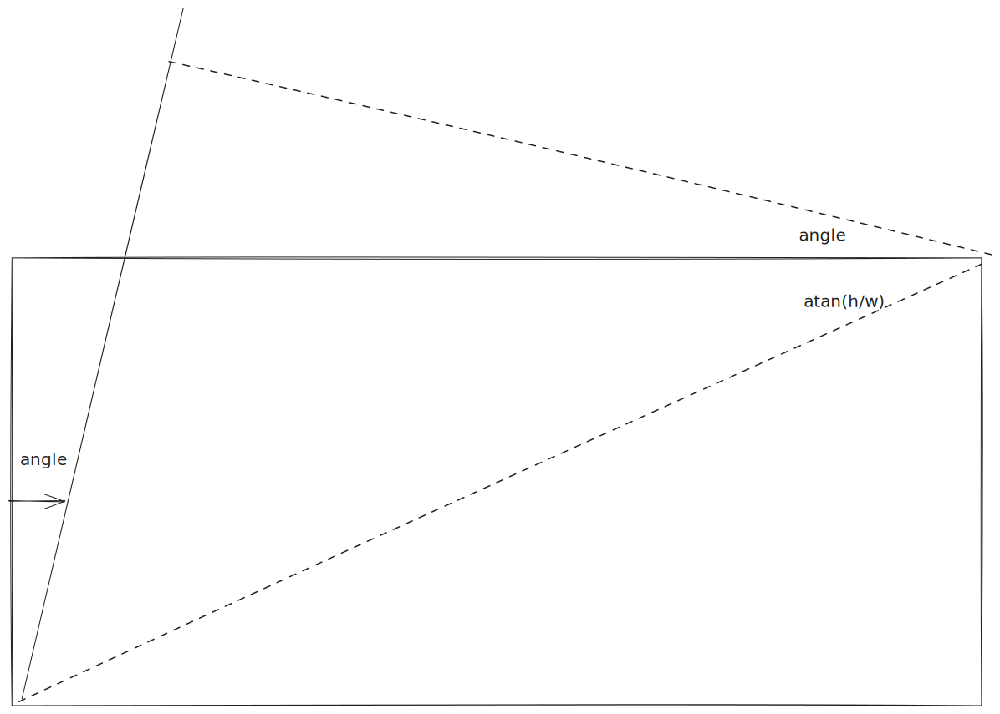

# 高级图片编辑器

## 渐变

归纳[CSS 渐变](https://developer.mozilla.org/zh-CN/docs/Web/CSS/gradient)，可以分为线性(linear)渐变、径向(radial)渐变、锥形(conic)渐变和他们的重复渐变。

Canvas API 渐变的实现，可以参考[MDN CanvasGradient](https://developer.mozilla.org/zh-CN/docs/Web/API/CanvasGradient)，但更多参数，颜色断点仅支持百分比。

我们的渐变不需要太多功能，参数就只是中心位置、角度、重复和颜色断点。

### 线性渐变

参考[MDN linear-gradient()](https://developer.mozilla.org/zh-CN/docs/Web/CSS/gradient/linear-gradient)，需要注意线性轴的位置，对应`ctx.createLinearGradient`

为了保证边角也应用渐变，不是裁切或填充，需要对轴进行计算，MDN 上有一副图示：

由于是线性，我们可以在轴的垂直方向平移轴以方便计算。

角度（angle）与一般数学上的定义不同，从-y 到+x，我们先不管这么多，现在只需要计算轴长，具体坐标才考虑角度。图中角假设为锐角。

起始坐标为$(0,h)$，终止坐标为$(\sin(a),h-\cos(a))$
